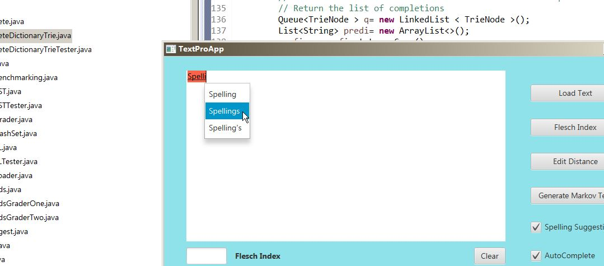
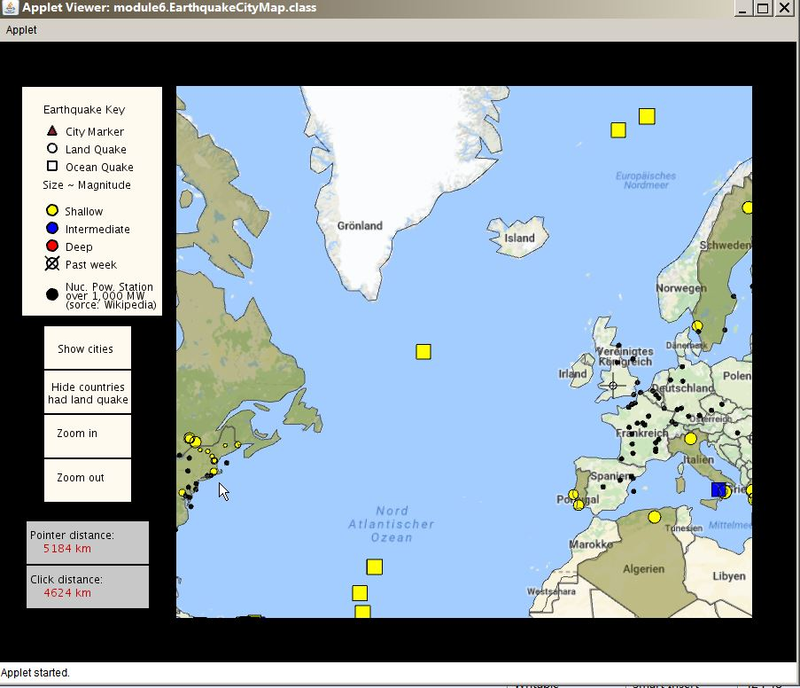

 
Dec 2017 **Learn Ruby** 
www.codecademy.com 
  
Jun 2017 		**Data Structures and Performance** 
authorized by *University of California, San Diego* and offered through Coursera 
<a href="https://www.coursera.org/learn/data-structures-optimizing-performance" target="_blank">
    <input type="button" value="Description" />
   </a>
   <a href="https://www.coursera.org/account/accomplishments/certificate/VK2T8VSYWEXG?lipi=urn%3Ali%3Apage%3Ad_flagship3_profile_view_base%3B0K%2FP01xfQbOyMHxl1FJCUA%3D%3D" target="_blank">
    <input type="button" value="Certificate" />
   </a>
     
   [{:width="300px"}](../images/trie.jpg){:target="_blank"}
  
May 2017 		**Object Oriented Programming in Java** 
authorized by *University of California, San Diego* and offered through Coursera 
<a href="https://www.coursera.org/learn/object-oriented-java" target="_blank">
    <input type="button" value="Description" />
   </a>
   <a href="https://www.coursera.org/account/accomplishments/certificate/PZ36FS4LZLHN" target="_blank">
    <input type="button" value="Certificate" />
   </a>
    
   [{:width="300px"}](../images/EQPSmap.jpg){:target="_blank"}
  
April 2017 		**30 Days of Code – Java** - [*www.hackerrank.com*](https://www.hackerrank.com/domains/tutorials/30-days-of-code){:target="_blank"}  
 
April 2017 - ... **Java challenges on hackerrank.com** -  
&emsp;&emsp;&emsp;&emsp;&emsp;&emsp;&emsp;&emsp;&emsp;&emsp;&emsp;&emsp;[/Java/Hun>>>>](https://www.hackerrank.com/leaderboard?country=Hungary&page=6&practice=java){:target="_blank"} 
&emsp;&emsp;&emsp;&emsp;&emsp;&emsp;&emsp;&emsp;&emsp;&emsp;&emsp;&emsp;[/Java>>>>](https://www.hackerrank.com/leaderboard?page=537&practice=java){:target="_blank"} 
  

   
